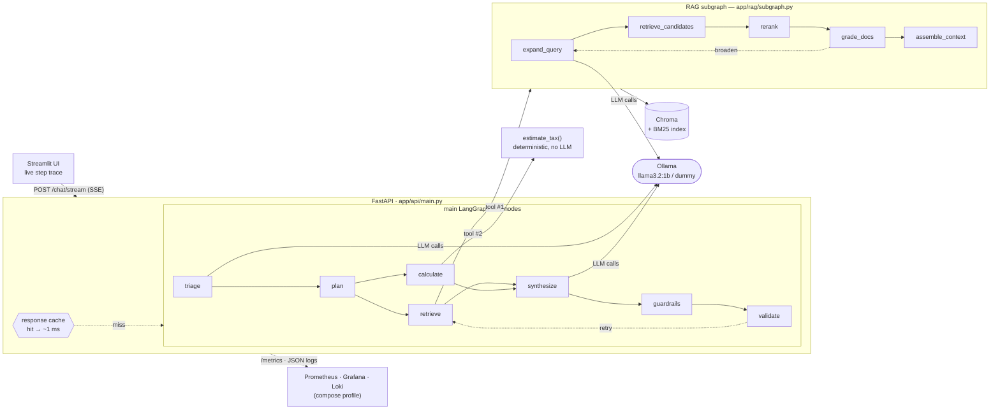

# Agentic RAG Tax Chatbot

[](https://github.com/Vicfirt/chat-bot-assignment/actions/workflows/ci.yml)


An Agentic RAG chatbot (LangGraph) that answers U.S. federal individual income
tax questions grounded in IRS publications (Pub. 17, 501, 505) and performs
deterministic federal tax estimates.

**In a hurry?** [Install and run](#install-and-run) is two commands. Jump to:
[Architecture](#architecture) · [Design rationale](#design-rationale-highlights)
· [Evaluation & performance](#evaluation-and-performance--results) ·
[Known limitations](#known-limitations)

## Where each requirement is met

| Requirement | Implementation |
|---|---|
| LangGraph workflow, ≥ 5 nodes | `app/graph/main_graph.py` — 7 nodes (`triage, plan, retrieve, calculate, synthesize, guardrails, validate`) |
| Autonomous decision-making / conditional routing | `triage` → 4 routes; loops in `grade_docs` and `validate` |
| Decomposition into subtasks + independent execution | `plan` fans out to `retrieve` ∥ `calculate` (parallel superstep, fan-in at `synthesize`) — `route_after_plan` |
| State management for intermediate results | `AgentState` TypedDict + `steps` reducer, `app/graph/state.py` |
| ≥ 2 tools, ≥ 1 non-retrieval | `app/tools/retriever_tool.py` (RAG) + `app/tools/tax_calculator.py` (deterministic, no LLM) |
| Modular RAG subgraph, not counted in the node budget | `app/rag/subgraph.py` — separate compiled graph, 5 nodes |
| Text data source, quality processing | IRS Pub. 17 / 501 / 505; SHA-pinned download + structure-aware chunking in `app/ingest/` |
| Open-source / dummy LLM + justification | `app/llm/provider.py` (pluggable `ollama` / `dummy`); trade-off in [Design rationale](#design-rationale-highlights) |
| Streamlit UI showing agent steps + RAG output | `app/ui/streamlit_app.py` — live SSE step panel, retrieval funnel, citations |
| Containerized; Dockerfile mandatory | `Dockerfile` (embedding + reranker models baked in) + `docker-compose.yml` (UI + API + Ollama; a one-shot `model-pull` service fetches the LLM) |
| Functional eval, 10–20 questions | `eval/questions.yaml` (15) + `eval/run_eval.py` → `docs/eval-results.md` |
| Load test, 50–200 queries | `loadtest/run_load.py` (100) → `docs/loadtest-results.md` |
| README: problem, architecture + rationale, results, install | this file |

## Problem and objectives

Individual tax rules are high-stakes and easy to misread. This assistant:

- answers rule-lookup questions with a citation to the exact publication,
  section, and page;
- when asked, estimates federal income tax from a filing status and income
  using a deterministic calculator (no LLM arithmetic);
- routes every question autonomously (rule lookup, calculation, both, or
  out-of-scope) instead of relying on the user to pick a mode;
- runs fully offline and reproducibly in `LLM_MODE=dummy`, and against a real
  local model (Ollama) in `LLM_MODE=ollama`.

## Justification

- **Why the problem is relevant** — every US filer faces these rules yearly;
  the amounts (standard deduction, bracket thresholds) change annually and are
  easy to misquote, and a wrong figure has real financial and legal cost.
- **What user need it addresses** — a plain-language answer to "what is the
  rule" and "what would I owe", each tied to the exact IRS publication, section,
  and page so the user can verify rather than trust.
- **Why agentic RAG is the right fit** — the questions are not homogeneous: some
  need only a definition lookup, some only arithmetic from given numbers, some
  both, and some are off-topic. A router picks the sub-pipeline per question; a
  deterministic calculator handles the math so the LLM never does arithmetic;
  and a validate step re-grounds an unsupported answer with one retrieval retry.
  Plain single-shot RAG would run retrieval on calc-only questions, has no place
  for the calculator, and cannot self-correct a weakly-grounded draft.

## Architecture

Three core services: **Streamlit UI** -> **FastAPI** (hosts the LangGraph app +
embedded Chroma) -> **Ollama** (local LLM; `LLM_MODE=dummy` bypasses it).



A fuller, styled version of this schema — every node, the RAG subgraph, the data
pipeline, and the measured numbers — is a standalone page:
**[vicfirt.github.io/chat-bot-assignment/system-design.html](https://vicfirt.github.io/chat-bot-assignment/system-design.html)**
(published from [`docs/system-design.html`](docs/system-design.html) by the Pages
workflow; also opens directly in a browser).

The UI calls `POST /chat/stream` (server-sent events): each **main-graph** node
emits its `record_step` as it finishes, and the UI appends it to a live
`st.status` panel — so a multi-minute CPU run shows
`triage ✓ → plan ✓ → retrieve ✓ → calculate ✓ → synthesize…` instead of one
opaque spinner. (RAG-subgraph nodes don't emit steps; their timings go to the
structured logs and Prometheus.) `POST /chat` (blocking JSON) is kept for
programmatic use and the load test.

### Main graph (7 nodes)

The [Architecture](#architecture) diagram above is the visual; the routing rules:

- `rag_only` runs only `retrieve`; `needs_calc` runs only `calculate`;
  `rag_plus_calc` fans `plan` out to **both, running concurrently**, and they
  rejoin at `synthesize` (LangGraph superstep barrier).
- `synthesize -> guardrails -> validate` is unconditional; `validate` either ends
  or sends one retry back to `retrieve` alone (the calc result is deterministic
  and persists in state).

Compiled node set (verified): `triage, plan, retrieve, calculate, synthesize,
guardrails, validate` (plus `__start__` / `__end__`).

**Decomposition into subtasks and independent execution.** A compound question
like "what's my tax after the standard deduction on $85k, single?" is broken
into subtasks that run as separate nodes with their own state slices: *look up
the governing rule* (`retrieve` → RAG subgraph, keyed on the question), *compute
the tax* (`calculate`, keyed on the `tax_profile` `plan` extracts), *compose a
cited answer* (`synthesize`). `triage` selects which subset a question needs. On
`rag_plus_calc` the two subtasks share no inputs, so `plan`'s conditional edge
returns `["retrieve", "calculate"]` — LangGraph dispatches both in one superstep
and they execute independently, then `synthesize` runs once both have landed
(`route_after_plan` in `app/graph/nodes/plan.py`; `test_graph_end_to_end.py`
asserts the fan-out). The wall-clock win is marginal here — `calculate` is a
sub-millisecond deterministic call — so the value is architectural: a real
parallel branch with a fan-in join. The RAG subgraph decomposes once more, one
level down, expanding the question into several targeted sub-queries.

- **triage** — LLM classifies the question into `rag_only` / `needs_calc` /
  `rag_plus_calc` / `out_of_scope` (autonomous routing).
- **plan** — extracts a structured `tax_profile` (filing status, income,
  dependents, tax year) — the input the `calculate` subtask needs. Skipped on
  `rag_only` / `out_of_scope`.
- **retrieve** — invokes the modular **RAG subgraph**. Tool #1 (retrieval). Runs
  on `rag_only` and (in parallel) `rag_plus_calc`.
- **calculate** — deterministic `estimate_tax(...)`: brackets + standard
  deduction, plus a non-refundable Child Tax Credit ($2,000/child 2024,
  $2,200/child 2025 per P.L. 119-21, with the §24 phase-out) — returns
  `total_tax`, `child_tax_credit`, `tax_after_credits`. Tool #2 (non-retrieval).
  Runs on `needs_calc` and (in parallel) `rag_plus_calc`; a no-op if `plan`
  produced no `tax_profile`.
- **synthesize** — LLM composes a cited answer from context and/or calc result.
- **guardrails** — deterministic, no model call: redacts SSNs, and flags
  citations to pages that were never retrieved and dollar amounts that trace to
  neither the calculator nor the retrieved context (on `rag_only` the amount
  check is recorded but not a retry trigger — rule answers legitimately restate
  published thresholds).
- **validate** — checks citations, numeric consistency, and the guardrail
  findings; on failure it sends exactly one retry back to `retrieve`
  (re-running retrieve -> synthesize -> guardrails; `calculate` does not re-run,
  its result persists in state), then ends regardless of the second result.

Out of scope for this prototype (production would add them, likely as a
dedicated pre/post model): input moderation, prompt-injection / jailbreak
screening, an LLM-judge faithfulness check, rate limiting, and an abuse policy.

### RAG subgraph (separate compiled graph, `app/rag/subgraph.py`)

Compiled node set (verified): `expand_query, retrieve_candidates, rerank,
grade_docs, assemble_context` (plus `__start__` / `__end__`). Each node is one
named RAG subsystem: query expansion (condenses a follow-up against chat history
into a standalone question, then LLM rewrite + deterministic domain hints),
candidate retrieval (dense + BM25 + RRF fusion), cross-encoder reranking (with
a table-first boost for amount questions), relevance grading, and context
assembly with citations. The `candidates → reranked → kept` counts flow back to
the API (`retrieval_funnel`) and show in the Streamlit trace panel.

### RAG techniques

**In the pipeline:** hybrid retrieval (dense + BM25 → RRF), cross-encoder rerank
with a table-first boost for amount queries, structure-aware chunking (split on
headings; tables and worked examples kept atomic), query expansion (LLM rewrite
+ deterministic domain hints + `tax_profile`-driven table/schedule queries), a
corrective retrieval loop (`grade_docs → expand_query` when results are thin,
`validate → retrieve` when the answer is ungrounded), follow-up condensing
against chat history, `tax_year` metadata filtering, and in-process
embedding + subgraph caches.

**Considered, deliberately out** — each fights the latency budget, needs an
ingest/training redesign, or both:

| Technique | Why not here / cheapest entry point |
|---|---|
| **Self-RAG / CRAG** — LLM relevance grader, reflection tokens | the `grade_docs` + `validate` loops are the deterministic version of this. A real LLM grader adds a call per retrieval round (against the "cut LLM calls" goal); reflection tokens need a fine-tuned model. Entry point: swap the `grade_docs` score threshold for a one-shot LLM relevance vote, behind a flag. |
| **Contextual retrieval** — LLM writes a situating blurb per chunk before embedding | strong published lift on exactly our table-retrieval gap, but a one-time ~1.5k LLM calls with a model stronger than the 1b default. The deterministic table-caption idea is the no-LLM approximation. |
| **Propositional chunking** — rewrite passages into atomic standalone statements | raises `context_precision` but loses the verbatim text, which fights the "quote the exact publication + page" requirement. |
| **Hierarchical / small-to-big** — retrieve tight chunks, feed the LLM the enclosing section | the direct lever on `context_precision` (≈ 0.31); needs a parent-document store beside the chunk index. |
| **RAPTOR** — recursive LLM-built summary tree | same ingest-cost class as contextual retrieval, for a corpus (~1.5k chunks) small enough that the payoff is marginal. |
| **HyDE** — embed a hypothetical answer | adds an LLM call per query and helps least on number/table-heavy corpora. |
| **Fine-tuned / larger embeddings** | `bge-small` is generic; tax terms of art ("qualifying relative", "MFJ") would benefit from a domain-tuned encoder. Needs a few hundred+ synthetic (query, positive, hard-negative) triples and a training run, and breaks "bake a stock model into the image". Try `bge-base` (768-d, stock) first. |

### Data source

Three IRS publications for tax year 2025, chosen to cover the question space with
minimal overlap:

| Pub. | Role |
|------|------|
| **17** — *Your Federal Income Tax* | the master guide: brackets / rate schedules, standard deduction, filing status, dependents, estimated tax overview |
| **501** — *Dependents, Standard Deduction, and Filing Information* | the authoritative detail on who is a dependent, filing-status tests, additional standard deduction |
| **505** — *Tax Withholding and Estimated Tax* | estimated-tax thresholds, due dates, the $1,000 safe harbor |

`app/ingest/sources.yaml` pins each PDF's URL and SHA-256. Ingestion
(`app/ingest/parse_chunk.py`) is structure-aware: it splits on headings, keeps
each table and each worked "Example" as one atomic chunk, drops index/TOC pages
by numeric density, and measures every chunk in real `bge-small` tokens (≤ 512).
The result is ~1,550 chunks carrying `pub` / `section` / `page` / `block_type`
metadata — `build_index` fails loudly if the count comes out far below that.

### Tools

| Tool | File | Kind |
|------|------|------|
| Retriever (RAG subgraph) | `app/tools/retriever_tool.py` | retrieval |
| Federal tax estimator | `app/tools/tax_calculator.py` | non-retrieval, deterministic |

### Design rationale (highlights)

- **Approach A (fixed agentic graph) over a ReAct agent** — small local models
  tool-call unreliably; an explicit graph makes routing and retries auditable.
  Tools are invoked structurally by nodes rather than through LLM tool-calls for
  the same reason.
- **Local `sentence-transformers` embeddings + embedded Chroma** — no API key,
  deterministic, metadata-aware, runs in the same process as the API.
- **Structure-aware chunking** — tax rules are hierarchical and citations need
  `section` + `page`, so chunks carry publication / section / page metadata.
- **Pluggable `ollama` / `dummy` LLM** — reconciles "real local model" with
  "reproducible and offline for graders". `dummy` is the default for tests,
  eval, and load tests.
- **`llama3.2:1b` as the default local model** — the `1b`-vs-`3b` comparison
  (*Model comparison* below) found identical functional and near-identical
  retrieval scores for ~10× less latency (~32 s vs ~360 s per request on CPU),
  because the deterministic guards and calculator carry correctness. `3b` writes
  more fluent prose (not scored by our metrics); an 8B (llama3.1, qwen2.5) more
  so, at more RAM and latency. Swap via `LLM_MODEL`; `1b` needs ~2 GB RAM.
- **Deterministic calculator, never LLM arithmetic** — tax math must be exact
  and testable.

### Libraries vs. hand-rolled

The retrieval stack is library-backed; only the orchestration glue is local.

| Concern | Library |
|---|---|
| Vector store + metadata filter | ChromaDB |
| Embeddings, cross-encoder rerank | `sentence-transformers` (`bge-small`, `ms-marco-MiniLM`) |
| Keyword scoring | `rank_bm25` |
| Graph runtime, subgraphs, retry loops | LangGraph |
| PDF extraction | `pdfplumber` / `pypdf` |
| API · UI · config · metrics | FastAPI · Streamlit · pydantic-settings · prometheus-client |

Hand-rolled (~40 lines): RRF fusion, the dense + BM25 → fuse → rerank →
table-boost sequence, and the structure-aware chunker. Kept explicit because the
amount-query table boost, the `grade_min_score` handling, and the `tax_year`
filter interplay are exactly what this project tunes — LangChain's
`EnsembleRetriever` / `ContextualCompressionRetriever` do the same job but move
that control into config, and RRF itself is ~10 lines in any library.

Libraries that would fill a specific gap if the matching extension is taken:

- **`ragas`** — faithfulness / answer-relevance / context-precision judges (the
  LLM-judge eval listed as out of scope); needs a judge LLM.
- **LlamaIndex** `SentenceWindowNodeParser` + `AutoMergingRetriever` — for
  hierarchical / small-to-big retrieval, instead of a hand-rolled parent store.
- **TEI** (`text-embeddings-inference`) — the embedding server for the
  documented scale-out path, not a custom service.

### Repository layout

```
app/
  api/main.py         FastAPI: /chat, /chat/stream (SSE), /health, /metrics
  graph/              main LangGraph: state.py, main_graph.py, nodes/
  rag/                modular RAG subgraph: subgraph.py, retriever.py, cache.py, nodes/
  tools/              retriever_tool.py (RAG) + tax_calculator.py (deterministic)
  ingest/             sources.yaml, download.py, parse_chunk.py, build_index.py
  llm/provider.py     pluggable ollama / dummy provider
  observability/      logging.py (JSON), metrics.py (Prometheus)
  ui/streamlit_app.py live-trace chat UI
eval/                 questions.yaml, run_eval.py, retrieval_metrics.py
loadtest/run_load.py  async load generator + report writer
observability/        Prometheus / Grafana / Loki / Promtail config
docs/                 generated eval-results*.md/.json, loadtest-results*.md
.github/workflows/    ci.yml (ruff lint + pytest on push/PR) · pages.yml (publish docs/ to GitHub Pages)
Dockerfile · docker-compose.yml · pyproject.toml (ruff + pytest) · requirements.lock
```

## Evaluation and performance — results

All figures come from generated artifacts (`python -m eval.run_eval`,
`python -m loadtest.run_load`). The headline run is `LLM_MODE=ollama` /
**`llama3.2:1b`**; a `3b` run is committed alongside for comparison
(`docs/eval-results-3b.md`, `docs/loadtest-results-ollama-3b.md`). See
*Model comparison* below for why 1b is the default.

### Functional evaluation — [`docs/eval-results.md`](docs/eval-results.md) (+ `.json`)

15 questions covering the three routes that run end to end (`rag_only`,
`rag_plus_calc`, `out_of_scope`). `run_eval` writes both a markdown table and a
machine-readable `docs/eval-results.json`.

| Metric | Result | Note |
|--------|--------|------|
| Route accuracy | 100% (15/15) | LLM label + deterministic `triage` guard |
| Retrieval hit rate (cited pub matches expected) | 100% | |
| Citation rate | 100% | |
| Numeric accuracy (calc questions) | 100% (3/3) | the number comes from the deterministic calculator, so the 1b can't break it |
| Keyword hit rate | 60.0% | weak `all(k in answer)` substring proxy; smoke signal only, not a headline |

Route accuracy and `tax_profile` extraction depend on the LLM; retrieval hit
rate, citation rate, and numeric accuracy are largely independent of generation
quality — which is the point of the architecture: a 1b model routes and phrases,
the calculator and the grounding checks keep the substance correct.

**`needs_calc` (pure calculation, no retrieval)** is validated at the node level
in `tests/test_graph_triage.py` rather than in this end-to-end set: with a real
small model the label is unstable on calc questions that resemble the
`rag_plus_calc` examples, and the triage guard deliberately biases every
dollar-amount question toward `rag_plus_calc` so the returned figure always
carries a citation. The calculator
path itself is covered by `tests/test_tax_calculator.py` and by q08–q10.

### Retrieval quality

Offline metrics in the `## Retrieval quality` section of the same file, judged at
`(publication, page)` granularity against the `relevant_pages` labels in
`eval/questions.yaml`, by invoking the RAG subgraph directly and reading its
`raw_hits` (post RRF fusion) → `reranked_hits` (post cross-encoder) →
`graded_hits` (kept for the prompt).

| Metric | Meaning | Before¹ | After (this run) |
|--------|---------|------|------|
| `recall_at_k` (`_tol1`) | gold pages in the reranked top-k (k = `search_k`) | 0.61 | **0.79** (0.88) |
| `precision_at_k` (`_tol1`) | of that top-k | 0.31 | **0.41** (0.50) |
| `mrr` (`_tol1`) | reciprocal rank of the first relevant page | 0.59 | **0.65** (0.67) |
| `context_precision` | fraction of the assembled context that is relevant | 0.31 | **0.38** |
| `hit_rate_fused` → `hit_rate_reranked` | gold page anywhere in the top-k | 0.79 → 0.79 | 0.86 → 0.86 |
| `rerank_mrr_lift` | ranking gain `rerank` adds over pure RRF | +0.13 | +0.01 |

¹ pre-fix `llama3.2:3b` run. `_tol1` counts a hit on a page ±1 from the label
(IRS content spans page boundaries); reported alongside strict, not instead.

Tracing the R@k = 0 cases (q08, q10) showed the cause was **query understanding
plus a rerank bug, not ranking order**: a calc question phrased "how much do I
owe on $85k, single?" matches neither the standard-deduction table nor the rate
schedule it needs (a number-only table has no prose surface, and no domain hint
fired), and even when the right table *was* in the pool the `grade_min_score`
floor dropped it because a prose-trained cross-encoder scores bare tables below
zero. Both fixed (calc-aware expansion from the `tax_profile`; table-boost runs
before the floor on amount queries): **q08/q10 R@k 0.0 → 1.0**. `rerank_mrr_lift`
fell to ~0 for a *good* reason — the deterministic expansion now puts the right
chunks at the top of the *fused* order (`mrr_fused` 0.45 → 0.64), so the
cross-encoder has little left to reorder, and on amount queries the table-boost
bypasses its scoring entirely. Residual misses (q04, q12) land one page off the
label — see [Further extensions](#further-extensions).

### Load test

Two runs — one isolates the retrieval path, one profiles the real model:

**Retrieval path** — [`docs/loadtest-results.md`](docs/loadtest-results.md),
`LLM_MODE=dummy CACHE_ENABLED=false`, 100 requests, concurrency 4, 0 errors,
first 5 discarded:

| p50 | p90 | p99 | mean | max | throughput |
|-----|-----|-----|------|-----|------------|
| ~1.0 s | ~1.3 s | ~1.6 s | ~0.75 s | ~1.7 s | ~4–5 req/s |

`retrieve` is the only non-zero node (~1.07 s mean). The latencies are bimodal —
a few ms when the retrieval lock is free, ~1 s when queued behind another
retrieval — which is the process-wide lock (see *Concurrency*) doing its job at
concurrency 4. (~1.07 s vs. ~0.7 s pre-fix is the cost of the wider 40-candidate
fusion pool.)

**Real model** — serial (concurrency 1; one CPU model can't overlap), per-node
mean, from
[`…-ollama-1b.md`](docs/loadtest-results-ollama-1b.md) /
[`…-ollama-3b.md`](docs/loadtest-results-ollama-3b.md):

| Node | `llama3.2:1b` | `llama3.2:3b` |
|------|------|------|
| `synthesize` (answer generation) | ~24 s | ~190 s |
| `retrieve` (incl. the subgraph's `expand_query` LLM rewrite, cold) | ~7 s | **~167 s** |
| `triage` (LLM classification) | ~3 s | ~13 s |
| `plan` / `calculate` / `guardrails` / `validate` | ~0 ms | ~0 ms |
| **p50 / request** | **~32 s** | **~360 s** |

#### Main bottleneck

**The request is LLM generation, end to end.** `synthesize` is the largest
single node; `retrieve` is second only because it contains the RAG subgraph's
`expand_query` LLM rewrite; `triage` is a third call. The deterministic nodes
are ~0 ms. In `dummy` mode all the LLM nodes collapse and `retrieve` (vector
search + rerank, lock-serialised) is all that's left.

#### Optimization recommendations

1. **Attack `synthesize`.** *(a) end-to-end response cache* keyed on the
   normalised question, checked before the graph — **done** (`app/api/main.py`):
   a repeat `/chat` returns in ~1 ms instead of ~50 s (1b) / ~6 min (3b).
   *(b) token streaming* from `synthesize` — the `/chat/stream` SSE plumbing
   already carries step events; extending it to model tokens would take
   time-to-first-token to ~1–2 s. Not done.
2. **Make `triage` + `expand_query` rules/embeddings-only.** They are two more
   LLM round-trips — **~31% of a 1b request, ~49% of a 3b request** (`expand_query`
   alone is ~2–3 min on 3b). The `triage` guard already overrides the model for
   the common cases; `expand_query`'s rewrite buys little over the domain-hint +
   `tax_profile` queries. Bonus: routing becomes deterministic. The saving grows
   with model size.

Beyond the app: a smaller model, a GPU, or a batching server (vLLM / TGI) — all
out of scope for a no-paid-API laptop prototype, and covered under *Concurrency*.

#### Model comparison — `1b` vs `3b`

Same 15-question eval, same retrieval config; the only variable is `LLM_MODEL`
([`eval-results.md`](docs/eval-results.md) is 1b,
[`eval-results-3b.md`](docs/eval-results-3b.md) is 3b).

| | `1b` | `3b` |
|---|---|---|
| Route / numeric / retrieval-hit accuracy | 100 / 100 / 100 | 100 / 100 / 100 |
| `recall_at_k` / `precision_at_k` | 0.79 / 0.41 | 0.79 / 0.41 |
| `mrr` / `context_precision` | 0.65 / 0.38 | 0.68 / 0.41 |
| p50 latency / `/chat` request | **~32 s** | **~360 s** |

**3b costs ~10× the latency for no measurable functional gain and near-identical
retrieval.** The deterministic guards (`triage` override, calculator, citation +
numeric grounding) carry correctness, so a bigger generator has little to add
*on these metrics* — which don't score prose fluency, where 3b is genuinely
better. Latency is entirely LLM-bound and scales with model size × number of LLM
calls; the graph, retrieval, and tools are flat at ~0–1 s. The levers that help
are architectural and model-independent (fewer LLM calls, the response cache,
token streaming); raw speed is a GPU / quantization / batching-server question.
`1b` is the default on this evidence.

**Caching** (`app/rag/cache.py`, in-process, `CACHE_ENABLED=false` to disable) —
three LRUs, each keyed with `index_fingerprint()` (retrieval config + live chunk
count) so a re-ingest or a knob change invalidates automatically. Hit/miss
counts are on `/metrics` as `rag_cache_events_total{cache=…}`:

- **query-embedding** — skips re-encoding a query string already seen (expansion
  + domain hints make queries repeat).
- **RAG-subgraph result** — a repeated question skips the whole subgraph
  (expansion LLM call + dense + BM25 + RRF + rerank).
- **end-to-end response** (`app/api/main.py`) — a repeated question skips the
  **entire graph, `synthesize` included**: on `llama3.2:1b` a cold `/chat` is
  ~50 s, a cache hit is ~1 ms (verified). Bypassed when the request carries
  chat history (the answer depends on it); the response is marked `cached: true`.
  This is recommendation 1(a) below, implemented.

Moving these to Redis is what lets multiple API workers share them (see
concurrency below).

**Concurrency.** The API is one `uvicorn` process; FastAPI runs the sync
`/chat` handler on its threadpool, so concurrent requests do run on separate
threads — but they share process-global state that isn't built for that: one
`chromadb.PersistentClient` (SQLite + hnswlib), one `SentenceTransformer`, one
`CrossEncoder`, the BM25 index, the `_compiled` graph. Left unguarded, the
retrieval path segfaulted the worker at concurrency ≥ 2 (native crash, no
traceback) — the shared Chroma client the prime suspect.

*Implemented — #1, serialise the unsafe section.* One process-wide
`threading.RLock` (`app/rag/retriever.py`) around every Chroma call and every
torch forward pass (`.encode` / `.predict`). Retrieval is now serial (~700 ms
in the load test, dominated by the cold model/HNSW warmup the first requests
queue behind); the minutes-long LLM synthesis still overlaps across threads.
BM25 and the loaded models are read-only and safe to share — only the Chroma
client and inference are guarded. Load test now runs clean at concurrency 4.

*Design — not implemented (infrastructure, not RAG):*

2. *Per-worker Chroma clients* — one `PersistentClient` per thread/worker on
   the same read-only path (SQLite is multi-reader), so retrieval parallelises;
   a small model pool or a lock kept only around inference.
3. *Async request path* — `async def chat` + `await _compiled.ainvoke` /
   `astream` (LangGraph supports both; sync nodes run in a threadpool). LLM
   calls move to `ollama.AsyncClient` — the real win, since a request awaiting
   a multi-minute generation no longer holds a thread. CPU-bound bits go
   through `asyncio.to_thread` / a `ProcessPoolExecutor`; Chroma stays wrapped
   with #2.
4. *Scale out* — retrieval + models as a separate service (HTTP/gRPC) so the
   agent API holds no native state and runs `uvicorn --workers N` behind a
   proxy; the LRUs move to **Redis**. Ollama then becomes the ceiling — multiple
   replicas or a batching server (vLLM/TGI), out of scope for a local
   no-paid-API prototype.

Realistic path: #1 is done; #3 + #2 are the target; #4 only for real traffic.

**No request cancellation.** `/chat` runs the graph to completion regardless of
the client; there is no abort path (it would need the async/multi-worker rework
above, plus a cancellation flag checked between nodes or an aborted Ollama
call). `/chat/stream` mitigates the *experience* — the Streamlit UI shows each
node completing live via SSE instead of one opaque spinner — but the work still
finishes server-side.

## Install and run

**Prerequisites:** Docker + Docker Compose, Python 3.11. No paid APIs, no API
keys. ~2 GB free RAM for the `llama3.2:1b` model (not needed in `dummy` mode).

### Step 1 — one-time: build the vector index

```bash
cp .env.example .env
make ingest       # downloads IRS Pub. 17 / 501 / 505, builds data/chroma/  (needs internet, ~2 min)
```

Each PDF's URL and SHA-256 are pinned in `app/ingest/sources.yaml`. After this
the stack runs fully offline.

### Step 2 — start the stack

```bash
make up            # UI on :8501, API on :8000
```

`make up` builds the image (embedding + reranker models baked in), starts
Ollama, and the one-shot `model-pull` service pulls `llama3.2:1b` (~1.3 GB, first
run only) before the API comes up. Answers are then written by the real model —
non-deterministic, ~30 s each on CPU.

**Offline / reproducible variant:** `LLM_MODE=dummy make up` skips the model pull
and the LLM entirely — every answer is a deterministic stub. This is the mode the
test suite and the retrieval eval run in; use it to reproduce the numbers in
[Evaluation](#evaluation-and-performance--results).

Both modes: open <http://localhost:8501> for the chat UI, or POST to
`http://localhost:8000/chat`. `make down` stops everything.

### Local (no Docker)

```bash
make install                                           # pip install -r requirements.lock
python -m app.ingest.build_index                       # needs internet, one time
LLM_MODE=dummy uvicorn app.api.main:app --port 8000
LLM_MODE=dummy streamlit run app/ui/streamlit_app.py   # separate shell
```

`requirements.txt` is the top-level list; `requirements.lock` is the
fully-pinned transitive resolution used by the Dockerfile and `make install`
(regenerate with `make lock`, needs [`uv`](https://docs.astral.sh/uv/)).

### Configuration

All settings are environment variables (pydantic-settings); the full list with
defaults is in `.env.example`. The ones you'd usually touch:

| Var | Default | Meaning |
|-----|---------|---------|
| `LLM_MODE` | `ollama` | `ollama` (real model) or `dummy` (deterministic, offline) |
| `LLM_MODEL` | `llama3.2:1b` | any Ollama tag; `llama3.2:3b` for better prose (~10× latency) |
| `OLLAMA_BASE_URL` | `http://ollama:11434` | Ollama endpoint |
| `LLM_FALLBACK_DUMMY` | `true` | fall back to dummy if Ollama is unreachable instead of erroring |
| `TAX_YEAR` | `2025` | calculator year + `tax_year` metadata filter on retrieval |
| `SEARCH_K` | `5` | chunks kept for the prompt |
| `RETRIEVAL_MODE` | `hybrid` | `hybrid` / `dense` / `bm25` |
| `RERANK_ENABLED` | `true` | cross-encoder rerank on/off |
| `CACHE_ENABLED` | `true` | in-process embedding + RAG-result LRUs |
| `LOG_LEVEL` / `LOG_JSON` | `INFO` / `true` | structured logging verbosity / format |

### Observability (optional)

The core stack (`make up` / `docker compose up`) is just `ollama`, `api`, `ui`.
The monitoring stack is a separate compose profile — nothing in the app path
depends on it:

```bash
make up-obs      # docker compose --profile observability up --build
# Grafana http://localhost:3001 (anon)  |  Prometheus :9090  |  Loki :3100  |  Pushgateway :9091
```

The API exposes Prometheus metrics at `/metrics`; the provisioned Grafana
dashboard ("Agentic RAG Tax Chatbot") shows:

| Group | Metrics |
|-------|---------|
| Request | `rag_request_duration_seconds` (p95 by route), `rag_requests_total` (throughput, error ratio) |
| Graph | `rag_node_duration_seconds` (7 main nodes), `rag_subgraph_node_duration_seconds` (5 RAG nodes), `rag_validate_retries_total` |
| LLM | `rag_llm_duration_seconds` (p95 by op), `rag_llm_calls_total` (by op), `rag_llm_tokens` (prompt/output), `rag_llm_fallback_total` (Ollama-unreachable → dummy) |
| Retrieval | `rag_context_words`, `rag_retrieval_chunks` |
| Offline eval | `rag_eval_*` gauges — `run_eval` pushes route accuracy, retrieval hit rate, Precision@k, Recall@k, MRR and rerank lift to the pushgateway when `PROM_PUSHGATEWAY` is set |

```bash
PROM_PUSHGATEWAY=localhost:9091 OLLAMA_BASE_URL=http://localhost:11434 \
  LLM_MODE=ollama python -m eval.run_eval      # results also land in Grafana
```

### Structured logging

`app/observability/logging.py` emits one JSON line per pipeline stage on stdout,
all sharing a `request_id`, so a single `/chat` call is greppable end to end:
`api.request.received` → `triage.routed` (llm route vs. final) → `rag.cache` →
`expand_query.expanded` (the rewritten queries) → `retrieve_candidates.fused`
(pool size + top `(chunk_id, pub, page, score)`) → `rerank.reranked` (scores
before/after) → `rag.context` (citations, context words) → per-node `*.done`
with timings → `api.request.completed`. `LOG_LEVEL=DEBUG` adds the heavy
payloads; SSNs are redacted unless `LOG_PII=true`; `LOG_JSON=false` for plain
text in local dev.

In the observability profile, **Promtail** ships every container's stdout to
**Loki**, wired into Grafana as a datasource. Trace one request in Grafana →
Explore → Loki:

```logql
{service="api"} | json | request_id = `a1b2c3d4`
```

`container`, `service`, `level` and `stage` are indexed labels; `request_id`,
`question`, `queries`, `top`, … are parsed from the JSON at query time.

### Tests / eval / load test

```bash
make lint                                              # ruff check .  (config in pyproject.toml)
make test                                              # LLM_MODE=dummy python -m pytest -q  (106 tests, ~40 s)

# functional + retrieval eval (any LLM_MODE; ollama for real route/answer quality)
LLM_MODE=ollama LLM_MODEL=llama3.2:1b OLLAMA_BASE_URL=http://localhost:11434 \
  python -m eval.run_eval                               # writes docs/eval-results.{md,json}

# load test — needs the API running in the matching mode
CACHE_ENABLED=false LLM_MODE=dummy python -m loadtest.run_load \
  --n 100 --concurrency 4 --warmup 5                    # retrieval-path profile
LLM_MODE=ollama LLM_MODEL=llama3.2:1b python -m loadtest.run_load \
  --n 8 --concurrency 1 --warmup 2 --timeout 400 \
  --out-md docs/loadtest-results-ollama-1b.md           # real-model per-node profile
```

## Known limitations

- **The LLM is the ceiling on answer quality.** Prose answers are written by
  `llama3.2:1b` by default — a small local model that can misread or
  over-generalise the retrieved text and mis-state figures. Calc answers lead
  with the deterministic tool's line so the number is never the model's;
  rule-lookup prose is guarded only by the citation + grounding checks, not by a
  faithfulness judge. The model knows nothing beyond the retrieved context — a
  stale index yields stale answers with no signal that anything is wrong. Output
  is non-deterministic even at `temperature 0.1`; `LLM_MODE=dummy` is
  reproducible but returns stub text, so the offline path validates the
  *pipeline*, not answer quality. And it is slow: ~30 s/answer on CPU with `1b`,
  ~6 min with `3b` (also the [main bottleneck](#main-bottleneck)).
- **Calculator.** `total_tax` is tax *before* credits; the headline figure
  (`tax_after_credits`) subtracts only a non-refundable Child Tax Credit. The
  income input is treated as **gross** — the tool subtracts the standard
  deduction itself — so stating a *taxable* figure over-deducts. No itemised
  deductions, no other credits, no state tax; tax years 2024–2025 only; every
  dependent is assumed a CTC-eligible qualifying child under 17.
- **Retrieval.** Finds the right *publication* reliably (100% hit rate in the
  functional eval); page-level `recall@5` is ~0.79 / `precision@5` ~0.41 after
  the calc-aware fixes. Residual misses (q04, q12) land one page off the label.
  See *Retrieval quality*.
- **Routing** depends on the LLM label, but the deterministic guard in `triage`
  overrides it for the money+calc and out-of-scope cases (both `1b` and `3b`
  score 100% route accuracy on the eval); `needs_calc` is folded into
  `rag_plus_calc` by design.
- **Concurrency.** Retrieval is serialised by a process-wide lock (native
  thread-safety) — one retrieval at a time. No request cancellation: `/chat`
  runs to completion regardless of the client.
- **UI has no persistence.** The Streamlit chat lives in `st.session_state`,
  which Streamlit clears on a full page reload — refreshing the browser starts a
  new session and the visible history is gone (the API keeps no session state
  either). Reruns within a connection (sending a message, widget clicks) are
  fine. Persisting across reloads would mean writing history to disk keyed by a
  `st.query_params` id; left out as demo scope.
- **Safety.** No input moderation, prompt-injection / jailbreak screening, rate
  limiting, or abuse policy — production would add a pre/post model (see
  *Architecture*). The output guardrails (SSN redaction, citation + numeric
  grounding) are deterministic and deliberately conservative.
- **Not tax advice** — every answer carries that disclaimer; this is an
  information-retrieval prototype, not a filing tool.

## Further extensions

Deliberately left out to keep the prototype lean; each is a bounded add-on:

- **Concurrency** — #1 (lock the Chroma/model critical section) is done; the
  async request path + per-worker clients, and a retrieval service +
  multi-worker + Redis to scale, are designed under *Concurrency* above.
- **Request cancellation** — a cancel endpoint that trips a flag checked between
  nodes / aborts the Ollama call; depends on the async rework above.
- **Langfuse** (LLM trace tree) — `run_agent` / `run_agent_stream` already take a
  `callbacks` list threaded into `_compiled.invoke(config={"callbacks": …})`.
  Add `langfuse`, wire a `CallbackHandler`, and run its Postgres-backed stack in
  its own compose profile. Dropped here because Loki (`| json | request_id=…`)
  plus the step panel already cover request tracing, and it needs Postgres.
- **Redis** for a shared response/retrieval cache across workers (the in-process
  LRUs become a fallback).
- **Retrieval.** The weak spot was calc questions: "how much do I owe on $85k,
  single?" needs the standard-deduction table and the rate schedule, but that
  phrasing points at neither. **Done** (measurement refreshes in the two-model
  pass; dummy-mode trace shows q08/q10 going R@5 0.0 → 1.0):
  - *Calc-aware expansion* — `plan`'s `tax_profile` is threaded into the RAG
    subgraph; on the calc routes `expand_query` adds deterministic
    `"{year} standard deduction {status}"` / `"{year} tax rate schedule {status}"`
    queries. No new model calls.
  - *Rerank vs. table floor* — a prose-trained cross-encoder scores bare number
    tables below zero, so the `grade_min_score` floor was dropping them before
    the table-boost could run. For amount queries the boost now reorders the
    full reranked pool and skips the floor.
  - *Wider fusion pool* — `dense/bm25_top_k` and `rerank_top_n` 20 → 40.
  - *±1-page label tolerance* — reported alongside strict
    (`recall_at_k_tol1`, `mrr_tol1`).

  Still open: `R@10`; better labels for the residual misses (q04, q12 land on
  pages adjacent to the gold ones); and the heavier techniques in
  [RAG techniques](#rag-techniques) (contextual / propositional chunking,
  hierarchical retrieval, fine-tuned embeddings).
